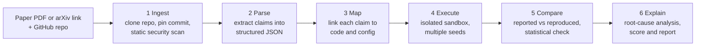
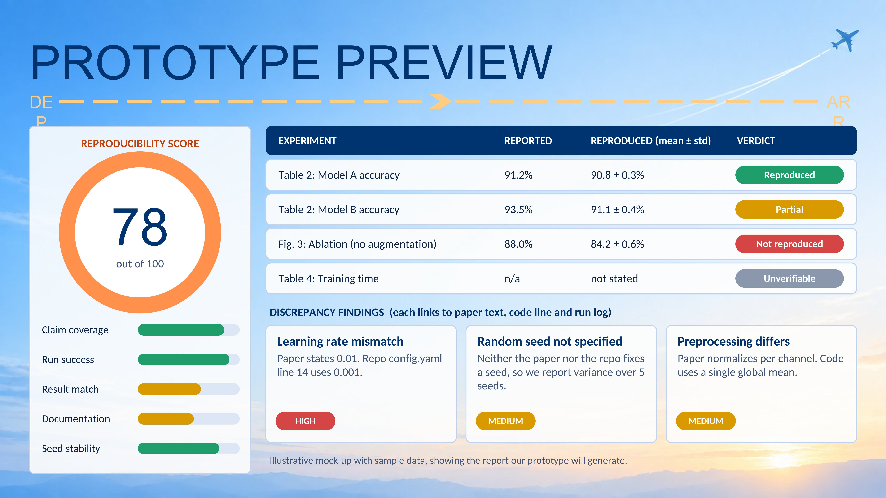

# ReproLens

**Paper in, verified verdict out.** An AI-powered platform that takes a machine learning research paper and its code repository, runs the experiments in a locked-down sandbox, and tells you whether the paper's reported results can actually be reproduced, with evidence.

> **Elevate 1.0 National Level Hackathon · Round 0 submission**
> Problem Statement: **EL-01 · AI-Powered ML Paper Reproducibility Platform**
> Team: `TILUGANG`
> Status: **design and prototype stage** (see [Project status](#project-status))

---

## Table of contents

1. [The problem](#the-problem)
2. [Our solution](#our-solution)
3. [How it works](#how-it-works)
4. [Key features](#key-features)
5. [What makes it different](#what-makes-it-different)
6. [Security-first sandbox](#security-first-sandbox)
7. [Reproducibility score](#reproducibility-score)
8. [Sample report](#sample-report)
9. [Tech stack](#tech-stack)
10. [Scalability and robustness](#scalability-and-robustness)
11. [Project status](#project-status)
12. [Repository structure](#repository-structure)
13. [References](#references)

---

## The problem

Machine learning research moves fast, but reproducing published results is still hard. A paper describes its method, while the details that decide the outcome (preprocessing, dataset splits, hyperparameters, dependency versions, random seeds) are scattered across supplementary material, config files, source code and READMEs. Small differences in any of them can produce numbers that do not match the paper.

The evidence shows how serious this is:

- In a study of **255 ML papers**, **162 (63.5%)** could be independently reproduced, which means **93 could not** (Raff, NeurIPS 2019).
- Even when code is shared, reproducibility is not guaranteed. Releasing code is necessary but not sufficient.
- Today's AI agents are not a reliable shortcut. The best agent scored about **21%** on the hardest tasks of **CORE-Bench** (computational reproducibility) and **21.0%** on OpenAI's **PaperBench** (replicating ICML papers from scratch).

There is a gap between **what a paper claims** and **what can actually be reproduced from its code**. ReproLens is built to bridge it.

## Our solution

ReproLens connects three things that are normally checked separately:

> **What the paper CLAIMS**  →  **What the code DOES**  →  **What actually RUNS**

You provide a paper (PDF or arXiv link) and its GitHub repository. ReproLens extracts the experiments the paper reports, finds the matching code and configuration, executes the experiments in an isolated environment, compares the results with the reported ones, and explains any discrepancy. It goes beyond checking that code exists or summarising a paper. Every verdict is backed by evidence.

## How it works



| Stage | What happens |
|---|---|
| **1. Ingest** | The paper and repository are fetched. The repo is cloned at a pinned commit and scanned for risky code and secrets before anything runs. |
| **2. Parse** | The PDF is converted into structured experiments: dataset, model, hyperparameters, metrics and the numbers the paper reports. Every extracted claim cites the page and section it came from. |
| **3. Map** | Each claim is linked to the scripts, configs and defaults in the repository. Missing, ambiguous or contradictory information is flagged. |
| **4. Execute** | The relevant experiments run in an isolated CPU-only container with strict limits. Each experiment runs with several random seeds. |
| **5. Compare** | Reproduced results (mean and standard deviation) are compared against reported values using tolerance bands and a statistical check. |
| **6. Explain** | A rule engine plus an LLM identifies likely causes of any mismatch and builds an evidence-linked report with a reproducibility score. |

## Key features

- **Claim extraction:** turns a paper into a structured list of experiments and reported results.
- **Claim-to-code mapping:** links claims to implementation, and flags what is missing or inconsistent.
- **Sandboxed execution:** runs untrusted research code safely.
- **Multi-seed, variance-aware comparison:** a 0.4% gap is not treated the same as a 10% gap.
- **Discrepancy analysis:** detects hyperparameter, data split, preprocessing, library version and missing-detail mismatches.
- **Evidence trail:** every finding links back to the paper text, the code line and the run log.
- **Human-in-the-loop review:** users can confirm or correct extracted claims before the run.
- **Exportable report:** PDF and JSON output with a per-experiment verdict.

## What makes it different

| Approach | Reads paper claims | Runs code safely | Explains gaps | Evidence trail |
|---|:---:|:---:|:---:|:---:|
| **ReproLens (ours)** | Yes | Yes | Yes | Yes |
| Paper-code listings | Partial | No | No | No |
| Hosted code capsules | No | Yes | No | Partial |
| Manual reproduction | Yes | Partial | Yes | Partial |
| LLM replication agents | Yes | Partial | No | No |

*Competitors are rated indicatively from public descriptions.*

What sets ReproLens apart:

1. **Evidence graph, not a summary.** Claim, code, run log and metric are linked together.
2. **Security-first execution.** Research repos are untrusted code, so we treat them that way.
3. **Variance-aware verdicts.** We use multiple seeds and tolerance bands, not a single run.
4. **Root-cause discrepancy engine.** We explain *why* results differ, not only *that* they differ.

## Security-first sandbox

Reproducing a paper means running code written by strangers. ReproLens is designed so that code cannot harm the host or leak data:

- Static scan before execution (Bandit, pip-audit, detect-secrets)
- One container per job, running as a non-root user
- **No network access** during execution, with datasets pre-cached
- Read-only filesystem apart from a scratch directory
- CPU, memory and time limits (for example 2 vCPU, 4 GB RAM, 20 minutes, configurable)
- Optional hardened runtime (gVisor) for stronger isolation
- Hard timeout and automatic kill, with the reason reported to the user

## Reproducibility score

Each paper receives a score from 0 to 100, built from five components:

| Component | What it measures |
|---|---|
| Claim coverage | How many claimed experiments could be extracted and mapped to code |
| Run success | How many experiments executed successfully |
| Result match | How closely reproduced results match reported values |
| Documentation | How complete the paper and repo are (seeds, versions, splits, configs) |
| Seed stability | How consistent results are across seeds |

The score is shown alongside per-experiment verdicts: **Reproduced**, **Partial**, **Not reproduced** or **Unverifiable**.

## Sample report



> **Note:** the numbers above are **illustrative sample data** that show the format of the report the prototype will generate. They are not results from a real paper.

## Tech stack

| Layer | Technology |
|---|---|
| Frontend | React, Tailwind CSS, Recharts |
| Backend | Python, FastAPI |
| Job queue | Celery, Redis |
| Database | PostgreSQL, object storage for artifacts |
| Execution | Docker (optionally hardened with gVisor) |
| PDF parsing | PyMuPDF, GROBID, table extraction |
| Language models | Open-source LLM (for example Qwen or Llama via Ollama) with API fallback |
| Retrieval | sentence-transformers embeddings, BM25 |
| Code analysis | Python `ast`, README and config parsing |
| Statistics | NumPy, SciPy |
| Security tools | Bandit, pip-audit, detect-secrets |

## Scalability and robustness

We designed the system around the question: *"If a big accelerator says yes tomorrow, can it handle success next week?"*

| If this happens | Our defence |
|---|---|
| Thousands of submissions at once | Stateless API, Redis queue, autoscaled workers, per-user quotas, fair scheduling |
| Malicious or broken repo (fork bomb, network call, infinite loop) | Container isolation, no network, resource limits, hard timeout, kill and report |
| Same paper submitted repeatedly | Result cache keyed by commit SHA and config hash, duplicate jobs merged |
| LLM API slow or down | Local open-model fallback, rule-based extraction, manual claim entry |
| Worker crashes mid-run | Idempotent jobs, retries with backoff, streamed logs, live status page |

**Testing plan:** a golden set of curated papers with known outcomes, an adversarial repo suite (fork bomb, exfiltration attempt, disk fill), load tests, and unit and integration tests in CI.

## Project status

This repository currently contains the **design, architecture and sample outputs** for our Round 0 (ideation and screening) submission. Implementation of the working prototype is planned for the next stage.

- [x] Problem analysis and literature review
- [x] System architecture and workflow design
- [x] Sandbox and security design
- [x] Sample report format
- [ ] Claim extraction module
- [ ] Repo analyzer and claim-to-code mapper
- [ ] Sandbox runner (Docker, multi-seed)
- [ ] Comparator and discrepancy engine
- [ ] Web dashboard
- [ ] Evaluation on a curated set of lightweight, CPU-friendly papers

**Roadmap:** working MVP on curated papers, then more frameworks and GPU workers, then a reproducibility badge and CI plug-in for repositories and journals.

## Repository structure

```
ReproLens/
├── README.md             <- you are here
├── docs/
│   ├── architecture.png  <- system architecture and workflow
│   └── README.md         <- short description of the design documents
└── sample_report/
    ├── sample_report.png <- illustrative report screenshot
    └── README.md         <- note that the data is sample data
```

## References

1. Raff, E. *A Step Toward Quantifying Independently Reproducible Machine Learning Research.* NeurIPS 2019.
2. Siegel, Z. S., Kapoor, S., Nadgir, N., Stroebl, B., Narayanan, A. *CORE-Bench: Fostering the Credibility of Published Research Through a Computational Reproducibility Agent Benchmark.* TMLR 2024. arXiv:2409.11363.
3. Starace, G. et al. *PaperBench: Evaluating AI's Ability to Replicate AI Research.* ICML 2025. arXiv:2504.01848.
4. Pineau, J. et al. *Improving Reproducibility in Machine Learning Research.* JMLR 2021.
5. Hutson, M. *Artificial intelligence faces reproducibility crisis.* Science 359, 2018.

---

*Built for Elevate 1.0, organised by DJS NSDC, Dwarkadas J. Sanghvi College of Engineering.*
